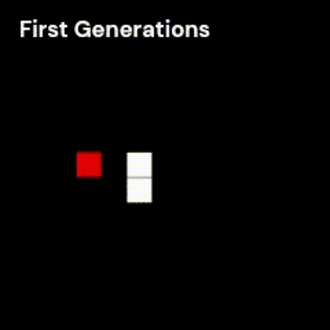

# sn**ai**ke

This project represents a first attempt at using AI and neural networks. It has its own built-in neural net model and aims to train it to be capable of playing the classic game of Snake.

<div align="center">
  
</div>

## How it works

* The program first generates a generation of 40 neural nets with random synapses' weights.
* Each individual of the generation plays the game
* Once each NN has finished its game, they are sorted by a score determined by number of apple eaten and type of death (wall, tail or infinite loop).
* The program generates a new generation by mutating the quarters of the previous one by respectively 1%, 3%, 10% and 15%.
* The process repeats from step 2.

During this time, you can visualize the best net of a generation on the SFML window, check the "How to use" section for more information.

## Installation

To run this project on your computer, you will need to have SFML installed. Here are the steps to install SFML and run this project:

* Download SFML from the official website [here](https://www.sfml-dev.org/download.php).
* Select the appropriate version for your operating system and extract the files to a directory of your choice.
* Download the source code for this project directly from this repository, or by cloning it using the command line:
```bash
git clone https://github.com/whazami/snaike.git
```
* Open the project in your preferred C++ IDE and configure the build settings to link SFML. You can find instructions for linking SFML in various C++ IDEs [here](https://www.sfml-dev.org/tutorials/2.5/start-vc.php).
* Build the project.

## How to use

The console will print 2 information:
* The current generation of the best net you are watching, you can go to the next one by pressing *space*.
* The maximum generation that can be watched.
